### Systems of Linear Equations

#### Summary

* linear equation
* system of linear equations
* consistent / inconsistent
* elementary row  operations: replacement, interchange, and scaling
* equivalent / row equivalent

#### A linear equations in the variables

	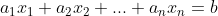

* coefficients : a1, a2, ..., an

* coefficients와 b는 실수 또는 허수

	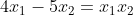

* 우측 항 x1x2 때문에 linear equation이 아님!

	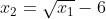

* 우측 항 루트 x1 때문에 linear equation이 아님

#### A system of linear equations

* 한 개 또는 한 개 이상의 linear equation의 집합

	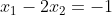
	 
	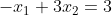

* Solution set: linear system이 있을 때, 모든 가능한 해의 집합

* 두 linear system이 **equivalent** => 같은 Solution set을 지닌다.

* linear system은...

1. 해가 없거나 (inconsistant)
2. 단 하나의 해만 있거나
3. 무수히 많은 해가 존재

#### Matrix notation

##### Example 1

	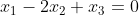
	 
	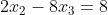			 
	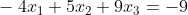

* coefficient matrix (3×3)

	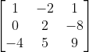

* augmented matrix (3×4)

	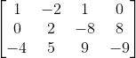

* replacement : row를 곱해서 다른 row에 더해 주는 행위
* scaling : 특정 row에 어떤 특정 값을 곱하거나 나누는 행위

	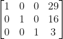

##### Example 2

	
	 
				 
	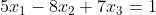

* interchange : 두 row를 교환하는 행위

	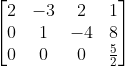

	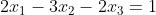
	 
	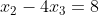		 
	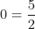

* **inconsistent!!** 해당 linear system은 해가 없다.

#### Elementary row operations

* replacement
* interchange
* scaling
* row equivalent : row operation을 통해 서로 오갈 수 있다.
* 두 개의 augmented matrix가 row equivalent하다면, 같은 solution set을 지닌다.